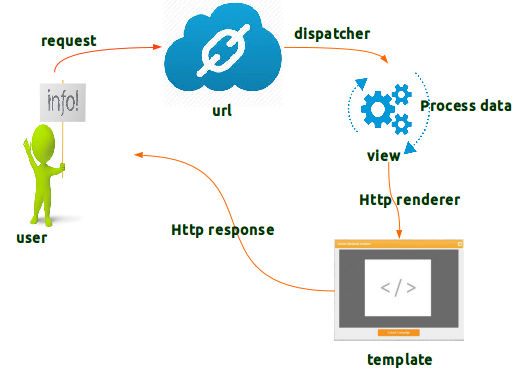

# blog

### Using python Django


---

---

## Chapter 1:

- ### Install djanjo in python using pip.

```
pip install Django
```

- ### Create the new project.

```
  django-admin Startproject blog
```

- ### To run project localhost.

```
 python manage.py runserver
```

---

## Chapter 2:



- ### URLS python file:

```python
from django.contrib import admin
from django.urls import path, include
from .import views

urlpatterns = [
    path('admin/', admin.site.urls),
    # path('articles/', include('articles.urls')),
    path(r'about/', views.about),
    path(r'', views.homepage)

]
```

- ### VIEWS python file:

```python
from django.http import HttpResponse
from django.shortcuts import render

def about(request):
    # return HttpResponse("about")
    return render(request, 'about.html')


def homepage(request):
    # return HttpResponse("homepage")
    return render(request, 'home.html')
```

The requesr go to urls python file and search for correct url and relevant view function is called which render the html file and send a response.

## Chapter 3:

#### A big project can be splited into different modules called as Django app.


- ### Create the new app inside the project.

```
  python manage.py startapp articles
```

By usintg this command new folder and files will be created representing the articles part of the project.

This folder contains its own views.py(you can create its own urls.py and Template file).

---

## Chapter 4:

#### Model is a object used to store data in the database and retrive it.

#### Models python file in the articles app is used for model creations.

- ### MODELS python file.

```python
from django.db import models

# Create your models here.


class Article(models.Model):
    title = models.CharField(max_length=100)
    slug = models.SlugField()
    body = models.TextField()
    date = models.DateField(auto_now_add=True)
    #
    #

    def __str__(self):
        return self.title

```

To connect and communicate with database we need to migrate the model.

- To migrate the built-in module :

```
  python manage.py migrate
```

- Make a migration file

```
  python manage.py makemigrations
```

- To migrate our own module after creating migration file :

```
  python manage.py migrate
```

After any change in the migration i.e change in model or adding new module we need to migrate to update.

---

## Chapter 5:

#### Django ORM is used to communicate or intercte with database.

- ### Open a new python shell.

```
  python manage.py shell
```

- ### import Article model to use it.

```
  from articles.modles import Article
```

- ### To display all objects.

```
  Article.objects.all()
```

- ### To create a object.

```
  article=Article()
```

- ### Insert values in a object.

```
  article.title="hello india"
```

- ### To save the changes of the object in the database.

```
  article.save()
```

- ### This is a builtin function to display object with one if its value.

```python
   def __str__(self):
       return self.title
```

---

## Chapter 6:

#### We can control the content of a site using **Django admin**

### Create a admin username and password which can be used for admin access and database access.

- ### To create a admin .

```
  python manage.py createsuperuser
```

- ### Enter the details .

```
 Username(leave blank for '[yourname]'):
 Email address:
 password:
```

- ### set ourr module for admin area (admin python file).

```
from .models import Article
# Register your models here.

admin.site.register(Article)

```

### You can change the details using thr admin interface.

---
